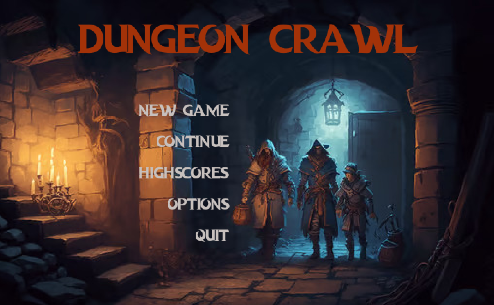

# Dungeon Crawl Game

Dungeon Crawl is my own twist on a dungeon crawler game written in Java, inspired by classic games like Doom and Wolfenstein 3D. It utilizes ray casting to render the world, similar to the techniques used in early ID Software titles.

## Table of Contents

- [Demo](#demo)
- [Installation](#installation)
- [Features](#features)

## Features
- **Ray Casting Renderer**: Rendering engine for the game world.
- **Game Engine**: Core game logic and mechanics.
- **Menu System**: Graphical user interface for game settings and navigation.
- **Settings Management**: Fullscreen, resolution, and other graphical settings.
- **NPC Initialization**: Randomized non-player character (NPC) generation based on difficulty.

## Demo

By simply starting the game, you will be welcomed by the main menu. A picture is a thousand words, so here is a preview of the game:

<div align="center">
    
    
</div>

## Installation

1. Clone the repository:
    ```sh
    git clone https://github.com/StefanBirsan/dungeon-crawl.git
    ```
2. Navigate to the project directory:
    ```sh
    cd dungeon-crawl
    ```
3. Build the project using Maven:
    ```sh
    mvn clean install
    ```
